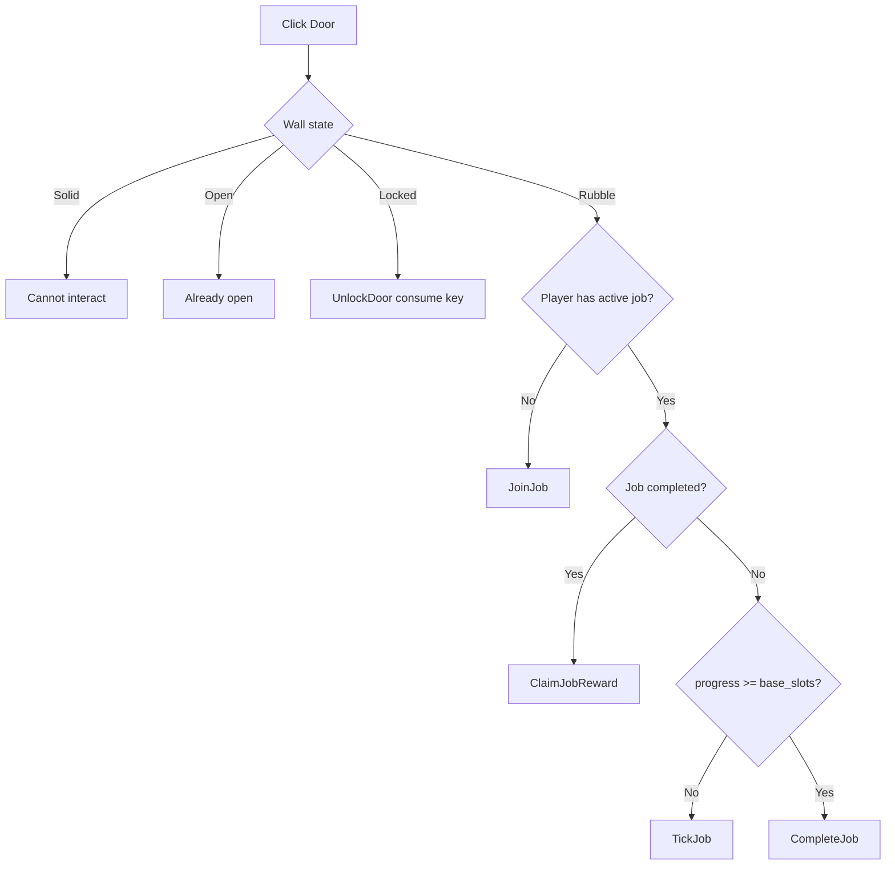
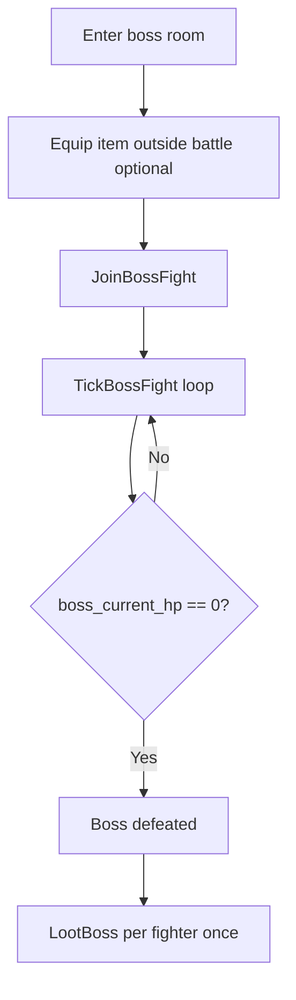

# ChainDepth Current Onchain Logic (Unity Dev View)

This is the current gameplay logic that exists onchain, translated into Unity-friendly terms.

## Core Accounts

### Global (`["global"]`)
- Season-wide config and stats.
- Important fields:
  - `season_seed`
  - `depth`
  - `skr_mint`, `prize_pool`
  - `jobs_completed`, `end_slot`

### Player (`["player", wallet]`)
- Per-player position and gameplay state.
- Important fields:
  - `current_room_x`, `current_room_y`
  - `active_jobs` (max 4 door jobs)
  - `equipped_item_id` (0 = no weapon equipped)
  - `jobs_completed`, `chests_looted`
  - `total_score` (lifetime extracted score)
  - `runs_extracted`
  - `current_run_start_slot`, `last_extraction_slot`

### Player Profile (`["profile", wallet]`)
- Visual profile data, currently:
  - `skin_id`
  - `display_name`

### Room (`["room", season_seed, x, y]`)
- Authoritative state for one map room.
- Door fields:
  - `walls[4]`: `0=solid`, `1=rubble`, `2=open`, `3=locked`, `4=entrance_stairs`
  - `door_lock_kinds[4]`: `0=none`, `1=skeleton`
  - `helper_counts`, `progress`, `base_slots`, `job_completed`, `bonus_per_helper`
- Center fields:
  - `center_type`: `0=empty`, `1=chest`, `2=boss`
  - `forced_key_drop`: chest grants `SkeletonKey x1` in addition to normal loot
  - `center_id`: boss identifier for Unity spawn selection
  - Boss runtime: `boss_max_hp`, `boss_current_hp`, `boss_total_dps`, `boss_fighter_count`, `boss_defeated`
- Loot memory:
  - `looted_by` (who already looted this center)

### Helper stake (`["stake", room, direction, player]`)
- One PDA per player per door direction job.
- Used for stake/refund/claim flow.

### Boss fight (`["boss_fight", room, player]`)
- One PDA per player per room boss.
- Stores fighter DPS snapshot used in boss HP calculations.

### Inventory (`["inventory", player]`)
- Onchain inventory stacks.
- Item stack = `(item_id, amount, durability)`.
- Max 64 stacks.

### Room Presence Index (`["presence", season_seed, x, y, player]`)
- Indexed occupancy record for scalable room rendering.
- Stores:
  - `skin_id`
  - `equipped_item_id`
  - activity (`idle` / `door job` / `boss fight`)
  - `is_current`

## Generation Rules (Now)

### Spawn room `(5,5)`
- Center is always empty.
- Start topology is fixed:
  - North = open
  - East = open
  - West = open
  - South = entrance stairs (`WALL_ENTRANCE_STAIRS`)

### Depth 1 rooms
- Chest chance = 50%.
- Guaranteed at least one chest in first ring:
  - one of the 4 adjacent rooms is forced chest by `season_seed`.

### Depth 2+ rooms
- Boss chance = 50%.
- If boss spawns:
  - `center_type = boss`
  - `center_id` set deterministically for Unity boss variant
  - HP scales by depth and boss id.
- Locked doors can appear deterministically on discovered rooms:
  - max 1 per room
  - never on return direction
  - requires key item to unlock
- One deterministic forced-key chest exists per depth ring (global-soft key guarantee).

## Door Job Flow (Rubble Doors)

`ChainDepthManager.InteractWithDoor(direction)` performs:
- `Join -> Tick -> Complete -> Claim`

Notes:
- Progress updates only when `tick_job` is sent.
- More helpers speed progress (`elapsed_slots * helper_count`).

## Extraction Flow (Entrance Stairs)

- Extraction is triggered by interacting with the spawn-room south entrance stairs.
- Onchain instruction: `exit_dungeon`.
- Requirements:
  - player must be in `(5,5)`
  - south wall must be entrance stairs
  - player must have no active door jobs
- Score:
  - `loot_score`: converted from extracted loot items (`item_id` 200..299)
  - `time_score`: bonus-only, front-loaded then strongly diminished:
    - first hour: +1 per 300 slots (~2 min)
    - after hour: +1 per 3000 slots (~20 min)
    - capped to `max(5, loot_score / 4)` so loot remains dominant
  - `run_score = loot_score + time_score`
- Inventory on extraction:
  - loot-range items are removed and converted to points
  - non-loot items (weapons/consumables) are kept
- Lifetime score accumulation:
  - `player.total_score += run_score`
  - `runs_extracted += 1`

## Boss Flow (Center Boss)

Rules:
- Only rooms with `center_type = boss` can be joined.
- Damage is time-based by total DPS of joined fighters.
- A fighter's DPS is snapped from `equipped_item_id` at join time.
- Weapon changes are expected outside combat flow.
- Looting a defeated boss is fighters-only and once per player.

## Chest/Boss Loot Rules

- `looted_by` prevents double-loot.
- Max looters per room center: 128.
- Chest and boss loot both write to onchain inventory.

Current item ids:
- `1 = Ore`
- `2 = Tool`
- `3 = Buff`
- `214 = SkeletonKey`

## Unity Methods Already Wired

In `ChainDepthManager.cs`:
- Existing:
  - `MovePlayer`, `JoinJob`, `TickJob`, `CompleteJob`, `ClaimJobReward`, `LootChest`, `BoostJob`, `AbandonJob`
- New:
  - `InteractWithCenter()` (auto selects chest/boss action)
  - `EquipItem(itemId)`
  - `JoinBossFight()`
  - `TickBossFight()`
  - `LootBoss()`
  - `GetCurrentRoomView()` / `GetCurrentPlayerView()` typed wrappers
  - `FetchRoomOccupants(roomX, roomY)` for occupant rendering
  - `StartRoomOccupantSubscriptions(roomX, roomY)` live updates from room-presence accounts
  - `SetPlayerSkin(skinId)` profile + presence sync
  - `CreatePlayerProfile(skinId, displayName)` onboarding profile setup + one-time starter bronze pickaxe

Typed Unity wrappers are in:
- `Assets/Scripts/Solana/ChainDepthDomainModels.cs`
  - `RoomView.HasChest()`, `RoomView.IsEmpty()`, `RoomView.TryGetMonster(out monster)`
  - enums for center type, wall state, direction, item ids

## Practical Constraints

- Active door jobs/player: 4.
- Inventory stacks/player: 64.
- Max looters per center: 128.
- Boss/chest/room state is season-scoped by `season_seed`.
