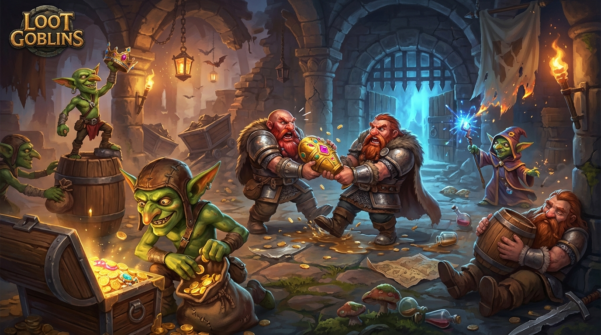

# Loot Goblins

Shared onchain dungeon crawler for Solana Seeker.

<p align="center">
  
</p>

## What Is Loot Goblins?

Loot Goblins is a mobile-first, shared dungeon crawler where players cooperate in a single evolving world state on Solana.

Runs are short and readable, but progression is persistent and verifiable:
- rooms and progression are onchain
- player participation is recorded through program-owned accounts
- seasonal resets create a repeatable race for depth and rewards

The design target is Seeker-native gameplay: quick sessions, clear interactions, and meaningful onchain actions instead of passive wallet gating.

## What This Repo Contains

- Unity client/game project (`Assets/`, `ProjectSettings/`, `Packages/`)
- Solana Anchor program and dev tooling (`solana-program/`)
- Optional offchain Seeker ID/feed helper API (`seeker-id-api/`)
- Design/implementation notes (`Docs/`)

## Gameplay Summary

Players share one evolving dungeon state on Solana devnet:

1. Spawn into the current room.
2. Move through open doors or join a rubble-clearing job.
3. Stake SKR to help clear doors (`join_job`) and optionally tip to speed progress (`boost_job`).
4. Claim rewards (`claim_job_reward`) or abandon early (`abandon_job`, partial refund/slash).
5. Loot room centers (chests/bosses), improve loadout, and push global depth each season.

## Built for Seeker + SKR

SKR is used as active game utility:
- `join_job`: stake to help clear rubble doors
- `boost_job`: tip to accelerate progress
- `claim_job_reward`: recover stake plus reward share
- `abandon_job`: partial refund with slash to the pool

This creates cooperative incentives while keeping each action tied to gameplay outcomes.

## Tech Stack

| Layer | Choice |
|---|---|
| Game client | Unity `6000.3.6f1`, C#, UI Toolkit |
| Solana integration | Solana Unity SDK + generated C# client (`Assets/Scripts/Solana/Generated/LGClient.cs`) |
| Onchain program | Solana + Anchor `0.32.1` (Rust) |
| Solana scripts/tests | TypeScript (`tsx`, Anchor test runner, npm scripts) |
| Optional backend | Node/TypeScript service in `seeker-id-api/` |
| Active network | Devnet |

## Art and Audio Pipeline

- Visual assets are ideated and generated in **SpriteCook** (`spritecook.ai`) for style exploration and rapid variation.
- Selected sprites are curated and integrated in Unity (`Assets/`) with final slicing, pivots, animation, and UI composition done in-editor.
- Audio FX and music are created with **ElevenLabs.io**, then edited/mixed for in-game use.

## Repository Layout

```text
.
|-- Assets/                  # Unity game and Solana integration scripts
|-- Docs/                    # Design notes, implementation docs, dev guides
|-- seeker-id-api/           # Optional display-name/feed helper API
|-- solana-program/          # Anchor program, tests, scripts, IDL
|-- scripts/                 # Root helper scripts (Unity/client generation)
`-- README.md
```

## Solana Workflow (Windows + WSL)

Use the `solana-program/scripts/wsl` helpers for Solana work.

```powershell
# Build Anchor program
wsl -d Ubuntu -- bash /mnt/e/Github2/SeekerDungeon/solana-program/scripts/wsl/build.sh

# Run commands inside solana-program with Solana/Anchor PATH configured
wsl -d Ubuntu -- bash /mnt/e/Github2/SeekerDungeon/solana-program/scripts/wsl/run.sh "npm install"
wsl -d Ubuntu -- bash /mnt/e/Github2/SeekerDungeon/solana-program/scripts/wsl/run.sh "npm test"
```

Important project convention:
- Use `npm` (not `yarn`) in `solana-program/`.
- Before finishing Solana changes, run `npm test`.
- If session auth flow changed, also run `npm run smoke-session-join-job`.

## Unity + IDL Regeneration

When program accounts/instructions/events change:

1. Build the Anchor program (refreshes IDL).
2. Regenerate Unity client from IDL:
   - `powershell ./scripts/generate-unity-client.ps1`
3. If required, update wrappers in `Assets/Scripts/Solana/LGDomainModels.cs`.

## Optional Seeker ID API

`seeker-id-api/` is an optional service for:
- wallet -> `.skr` display name resolution
- lightweight offchain feed endpoints for UX

Run locally:

```powershell
cd seeker-id-api
npm install
npm run dev
```

See `seeker-id-api/README.md` for env vars and Railway deployment notes.

## Current Status

- Onchain systems include room traversal, helper-stake job flow, chest/boss interactions, and inventory/storage accounts.
- Unity integration includes generated client bindings plus domain wrappers for game-facing use.
- Development and smoke testing are currently devnet-first.

## Key References

- `solana-program/README.md` (program-specific details)
- `Docs/wsl-solana-commands.md` (WSL command patterns)
